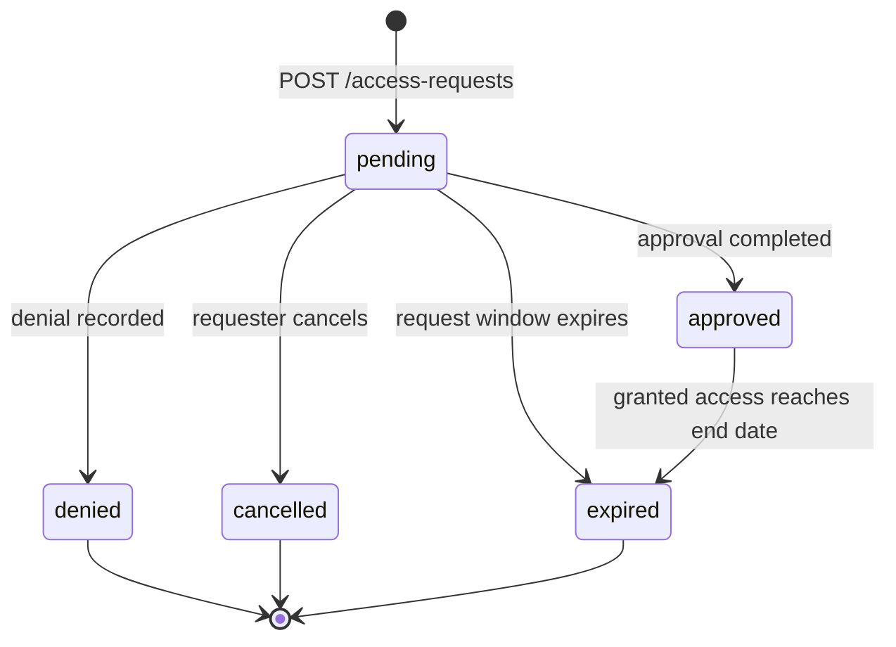

# AccessFlow API - OpenAPI 3.1 Documentation Sample

**Michael K. Levesque - Technical Documentation Portfolio**

AccessFlow is a fictional identity-governance API created as a professional portfolio sample. The project demonstrates how I document a compact REST API for implementers, reviewers, and support teams using **OpenAPI 3.1**, reusable JSON Schema components, OAuth 2.0 scopes, examples, error contracts, lifecycle rules, and a Git-based validation workflow.

> **Portfolio status:** Original demonstration work. The API, organization, endpoints, identities, and data are fictional. No employer, customer, or proprietary material is included.

## What this sample demonstrates

- OpenAPI 3.1 specification design and source authoring
- Resource-oriented REST operations and stable operation IDs
- OAuth 2.0 client-credentials scopes
- Idempotent write operations with `Idempotency-Key`
- Request tracing with `X-Correlation-ID`
- Reusable schemas, headers, parameters, responses, and examples
- JSON Schema Draft 2020-12 concepts, including explicit nullability
- Standardized `application/problem+json` error responses
- Positive and negative example payloads
- Pagination using opaque cursors
- API lifecycle and state-transition documentation
- Docs-as-code structure with branch, pull-request, and CI quality gates
- Automated validation of internal references, operation IDs, and JSON examples

## Portfolio files

| File | Purpose |
| --- | --- |
| [`openapi.yaml`](openapi.yaml) | Source-of-truth OpenAPI 3.1 contract |
| [`docs/AccessFlow_API_Developer_Guide.pdf`](docs/AccessFlow_API_Developer_Guide.pdf) | Portfolio-ready developer guide |
| [`examples/`](examples/) | Request, success-response, and error examples |
| [`scripts/validate_examples.py`](scripts/validate_examples.py) | Validates OpenAPI structure, `$ref` targets, operation IDs, and examples |
| [`scripts/check_repository.py`](scripts/check_repository.py) | Checks repository hygiene and lightweight documentation quality |
| [`CONTRIBUTING.md`](CONTRIBUTING.md) | Branch, review, authoring, and acceptance workflow |
| [`.github/workflows/validate.yml`](.github/workflows/validate.yml) | Automated GitHub Actions quality gates |
| [`CHANGELOG.md`](CHANGELOG.md) | Version history |

## API at a glance

| Method | Path | Purpose | Required scope |
| --- | --- | --- | --- |
| `GET` | `/v1/entitlements` | Discover requestable entitlements | `access-requests.read` |
| `POST` | `/v1/access-requests` | Submit a new access request | `access-requests.write` |
| `GET` | `/v1/access-requests/{requestId}` | Retrieve request state and decision history | `access-requests.read` |
| `POST` | `/v1/access-requests/{requestId}/decisions` | Approve or deny an assigned request | `access-decisions.write` |
| `POST` | `/v1/access-requests/{requestId}/cancel` | Cancel a pending request | `access-requests.write` |

## Request lifecycle



## Quickstart

The sample server URLs use the reserved `.test` domain and are intentionally non-routable.

### 1. Obtain an OAuth token

```bash
curl -X POST 'https://auth.example.test/oauth2/token' \
  -u "$CLIENT_ID:$CLIENT_SECRET" \
  -H 'Content-Type: application/x-www-form-urlencoded' \
  --data-urlencode 'grant_type=client_credentials' \
  --data-urlencode 'scope=access-requests.write access-requests.read'
```

### 2. Create an access request

```bash
curl -X POST 'https://api.example.test/accessflow/v1/access-requests' \
  -H "Authorization: Bearer $ACCESS_TOKEN" \
  -H 'Content-Type: application/json' \
  -H 'Idempotency-Key: 9bf6c87e-20ab-4f98-af18-fd8375832f6c' \
  -H 'X-Correlation-ID: 3ae9a6d3-aee6-4f55-b70e-6401cd1d98f6' \
  --data @examples/create-access-request.json
```

Expected result: `201 Created`, a `Location` header for the new resource, a returned correlation ID, and an access request in `pending` state.

### 3. Retrieve the request

```bash
curl 'https://api.example.test/accessflow/v1/access-requests/arq-01K5JQ8YDX2X64QAY4R4A9T7DG' \
  -H "Authorization: Bearer $ACCESS_TOKEN"
```

## Error contract

Errors use `application/problem+json`. A stable machine-readable `code` supports client branching, while `correlationId` connects the caller's failure to service logs.

```json
{
  "type": "https://api.example.test/problems/validation-error",
  "title": "Validation failed",
  "status": 422,
  "detail": "One or more fields failed validation.",
  "code": "validation_error",
  "correlationId": "3ae9a6d3-aee6-4f55-b70e-6401cd1d98f6",
  "errors": [
    { "field": "justification", "message": "must contain at least 20 characters" }
  ]
}
```

## Validation and CI

Run the same core quality gates locally that GitHub Actions runs on pushes to `main` and pull requests:

```bash
python -m pip install -r requirements.txt
python scripts/validate_examples.py
python scripts/check_repository.py
```

The OpenAPI validator checks that the YAML parses, the document declares OpenAPI 3.1, internal component references resolve, operation IDs are unique, and the supplied JSON examples validate against their corresponding schemas. The repository checker verifies required files, local Markdown links, basic text hygiene, and exclusion of temporary render output and editable Office source.

See [`CONTRIBUTING.md`](CONTRIBUTING.md) for the branch, review, and acceptance workflow.

## Documentation decisions

The API contract deliberately separates **authentication** from **authorization**: possession of a valid token is not enough; each protected operation documents the OAuth scope required to perform it. Write operations document idempotency so clients can retry safely. Correlation IDs are documented consistently on requests and responses to improve supportability. Error responses use one reusable contract so client developers do not need to interpret a different shape for every failure mode.

The sample also documents business-state conflicts separately from validation errors. For example, a syntactically valid approval attempt can return `409 Conflict` when the request is no longer awaiting that approver, while invalid input returns `422 Unprocessable Content`.

## Author contribution

I designed the fictional access-request workflow, information model, resource paths, authentication scopes, request and response contracts, examples, error model, lifecycle guidance, validation approach, CI workflow, and portfolio documentation.
